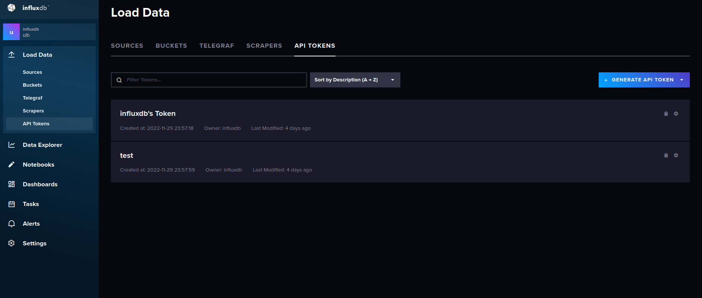
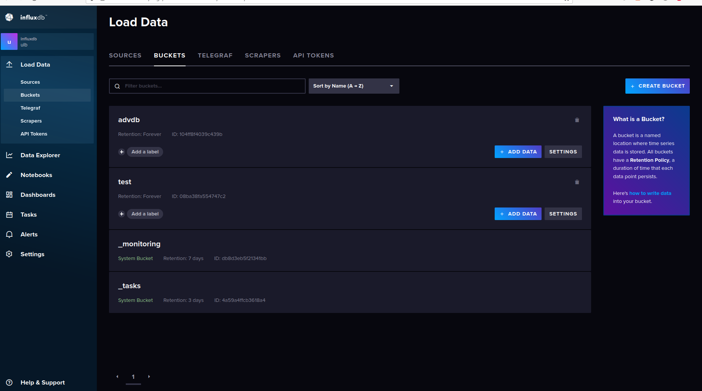

# Findata Influx DB

## Install Influx

Follow https://docs.influxdata.com/influxdb/v2.5/install/ for influx <b>2.5</b> installation

## Install Influx CLI
Install Influx CLI: https://docs.influxdata.com/influxdb/cloud/tools/influx-cli/

## Setup The Database
Please put organization as `ulb` when creating your ULB account.

## Loading the Data

### Generate the data

Open `etl.ipynb` file, replace `FILE` and `BASE_FILE` with the `tick_price_file` and `tick_base_file` directory. Run the notebook and wait until it generate the data into `CHRONOGRAF_PATH` directory.

<b>Important Note: You have to rerun this steps everytime you want to reload and change the scale factor</b>

### Getting Token
https://docs.influxdata.com/influxdb/cloud/security/tokens/create-token/

This steps is to acquiring token for running the script from influxdb

Login to http://localhost:8086



Generate new token for your application and do not forget to save it somewhere.

### Manual Method

### Deleting the previous data

Use this method in case creating database method is not working from the script. Sometimes deleting the data takes a lot of time both from the python wrapper and from the CLI.


<b>Deleting bucket:</b>

This step is for deleting previous data in case you have working database or have loaded  data before. Please login into http://localhost:8086the



Click delete on <b>advdb</b> bucket. 

<b>Creating new bucket:</b>

Recreate the bucket by clicking <b>Create new bucket</b> button. Name the new bucket <b>advdb</b>

<b> Reassign Retention Policy:</b>

Open your terminal and run this script
```sh
influx v1 dbrp create --db advdb --rp autogen --bucket-id {bucket_id} --org ulb --token {token} --default
```

replace `bucket_id` and `token` with your own.

### Importing Data
Open `execute_load_data.sh` inside `data` directory and changes the token inside the file with your token.

Run this script
```sh
bash execute_load_data.sh
```

Data will successfully loaded.

## Running the script

### Loading the data
If you <b>have performed</b> loading the data manually you need to comment this line in the `run_query.py`
```python
create_database(args.file_path, token)
```

Otherwise, you can uncomment the line and run the create database from the script.

### Running the benchmark

Before running the script, move to the inside `influxdb` directory.

Run this scropt to run the benchmark

```sh
python run_query.py -s {scale_factor} -f {data_path} -q ./queries/ -r ./results/ -t {your_token}
```

- `{token}` can be replaced with your own influxdb token
- `{data_path}` can be replaced with the path of the chronograf file from etl script
- `{scale_factor}` for specifying the scale factor

In case you manually imported the data please run this script instead

```sh
python run_query.py -s {scale_factor} -q ./queries/ -r ./results/ -t {your_token}
```
